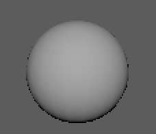
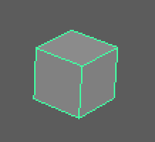
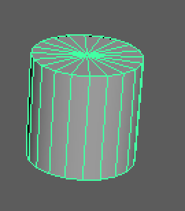
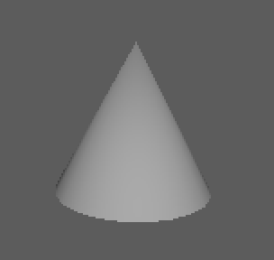
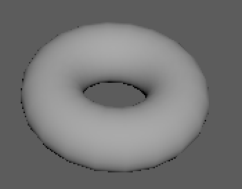
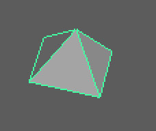
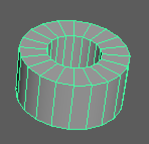
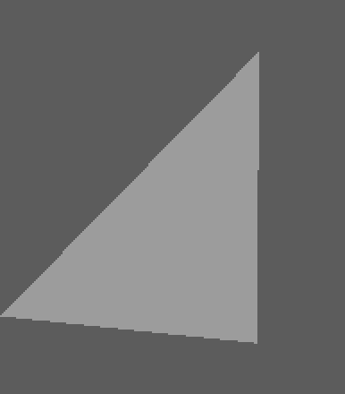

# 1. Modeling-Polygons

출처: [http://download.autodesk.com/us/maya/2011help/CommandsPython/](http://download.autodesk.com/us/maya/2011help/CommandsPython/)

## 1. PolySphere



polySphere\(\[[axis](http://download.autodesk.com/us/maya/2011help/CommandsPython/polySphere.html#flagaxis)=\[linear, linear, linear\]\], \[[constructionHistory](http://download.autodesk.com/us/maya/2011help/CommandsPython/polySphere.html#flagconstructionHistory)=boolean\], \[[createUVs](http://download.autodesk.com/us/maya/2011help/CommandsPython/polySphere.html#flagcreateUVs)=int\], \[[name](http://download.autodesk.com/us/maya/2011help/CommandsPython/polySphere.html#flagname)=string\], \[[object](http://download.autodesk.com/us/maya/2011help/CommandsPython/polySphere.html#flagobject)=boolean\], \[[radius](http://download.autodesk.com/us/maya/2011help/CommandsPython/polySphere.html#flagradius)=linear\], \[[subdivisionsX](http://download.autodesk.com/us/maya/2011help/CommandsPython/polySphere.html#flagsubdivisionsX)=int\], \[[subdivisionsY](http://download.autodesk.com/us/maya/2011help/CommandsPython/polySphere.html#flagsubdivisionsY)=int\], \[[texture](http://download.autodesk.com/us/maya/2011help/CommandsPython/polySphere.html#flagtexture)=int\]\)

```python
import maya.cmds as cmds

# Create a sphere, with 10 subdivisions in the X direction,
# and 15 subdivisions in the Y direction,
# the radius of the sphere is 20.
cmds.polySphere(sx=10, sy=15, r=20)

# Create a sphere, called "mySphere", on each direction there are 5 subdivisions.
cmds.polySphere( n='mySphere', sx=5, sy=5)

# Query the radius of the new sphere
r = cmds.polySphere( 'mySphere', q=True, sx=True )
```

## 2. polyCube



polyCube\(\[[axis](http://download.autodesk.com/us/maya/2011help/CommandsPython/polyCube.html#flagaxis)=\[linear, linear, linear\]\], \[[constructionHistory](http://download.autodesk.com/us/maya/2011help/CommandsPython/polyCube.html#flagconstructionHistory)=boolean\], \[[createUVs](http://download.autodesk.com/us/maya/2011help/CommandsPython/polyCube.html#flagcreateUVs)=int\], \[[depth](http://download.autodesk.com/us/maya/2011help/CommandsPython/polyCube.html#flagdepth)=linear\], \[[height](http://download.autodesk.com/us/maya/2011help/CommandsPython/polyCube.html#flagheight)=linear\], \[[name](http://download.autodesk.com/us/maya/2011help/CommandsPython/polyCube.html#flagname)=string\], \[[object](http://download.autodesk.com/us/maya/2011help/CommandsPython/polyCube.html#flagobject)=boolean\], \[[subdivisionsX](http://download.autodesk.com/us/maya/2011help/CommandsPython/polyCube.html#flagsubdivisionsX)=int\], \[[subdivisionsY](http://download.autodesk.com/us/maya/2011help/CommandsPython/polyCube.html#flagsubdivisionsY)=int\], \[[subdivisionsZ](http://download.autodesk.com/us/maya/2011help/CommandsPython/polyCube.html#flagsubdivisionsZ)=int\], \[[texture](http://download.autodesk.com/us/maya/2011help/CommandsPython/polyCube.html#flagtexture)=int\], \[[width](http://download.autodesk.com/us/maya/2011help/CommandsPython/polyCube.html#flagwidth)=linear\]\)

```python
import maya.cmds as cmds

cmds.polyCube( sx=10, sy=15, sz=5, h=20 )
#result is a 20 units height rectangular box
#with 10 subdivisions along X, 15 along Y and 20 along Z.

cmds.polyCube( sx=5, sy=5, sz=5 )
#result has 5 subdivisions along all directions, default size

# query the width of a cube
w = cmds.polyCube( 'polyCube1', q=True, w=True )
```

## 3. polyCylinder



polyCylinder\(\[[axis](http://download.autodesk.com/us/maya/2011help/CommandsPython/polyCylinder.html#flagaxis)=\[linear, linear, linear\]\], \[[constructionHistory](http://download.autodesk.com/us/maya/2011help/CommandsPython/polyCylinder.html#flagconstructionHistory)=boolean\], \[[createUVs](http://download.autodesk.com/us/maya/2011help/CommandsPython/polyCylinder.html#flagcreateUVs)=int\], \[[height](http://download.autodesk.com/us/maya/2011help/CommandsPython/polyCylinder.html#flagheight)=linear\], \[[name](http://download.autodesk.com/us/maya/2011help/CommandsPython/polyCylinder.html#flagname)=string\], \[[object](http://download.autodesk.com/us/maya/2011help/CommandsPython/polyCylinder.html#flagobject)=boolean\], \[[radius](http://download.autodesk.com/us/maya/2011help/CommandsPython/polyCylinder.html#flagradius)=linear\], \[[subdivisionsX](http://download.autodesk.com/us/maya/2011help/CommandsPython/polyCylinder.html#flagsubdivisionsX)=int\], \[[subdivisionsY](http://download.autodesk.com/us/maya/2011help/CommandsPython/polyCylinder.html#flagsubdivisionsY)=int\], \[[subdivisionsZ](http://download.autodesk.com/us/maya/2011help/CommandsPython/polyCylinder.html#flagsubdivisionsZ)=int\], \[[texture](http://download.autodesk.com/us/maya/2011help/CommandsPython/polyCylinder.html#flagtexture)=int\]\)

```python
import maya.cmds as cmds

# Create a rectangle, with 10 subdivisions in the X direction,
# 15 subdivisions in the Y direction and 20 subdivisions in the Z direction,
# the height of the cylinder is 20.
cmds.polyCylinder( sx=10, sy=15, sz=5, h=20)

# Create a cylinder, called "myCylinder", on each direction there are 5 subdivisions.
cmds.polyCylinder(n='myCylinder', sx=5, sy=5, sz=5)

# Query the radius of "myCylinder"
r = cmds.polyCylinder( 'myCylinder', q=True, r=True )
```

## 4. polyCone



polyCone\(\[[axis](http://download.autodesk.com/us/maya/2011help/CommandsPython/polyCone.html#flagaxis)=\[linear, linear, linear\]\], \[[constructionHistory](http://download.autodesk.com/us/maya/2011help/CommandsPython/polyCone.html#flagconstructionHistory)=boolean\], \[[createUVs](http://download.autodesk.com/us/maya/2011help/CommandsPython/polyCone.html#flagcreateUVs)=int\], \[[height](http://download.autodesk.com/us/maya/2011help/CommandsPython/polyCone.html#flagheight)=linear\], \[[name](http://download.autodesk.com/us/maya/2011help/CommandsPython/polyCone.html#flagname)=string\], \[[object](http://download.autodesk.com/us/maya/2011help/CommandsPython/polyCone.html#flagobject)=boolean\], \[[radius](http://download.autodesk.com/us/maya/2011help/CommandsPython/polyCone.html#flagradius)=linear\], \[[subdivisionsX](http://download.autodesk.com/us/maya/2011help/CommandsPython/polyCone.html#flagsubdivisionsX)=int\], \[[subdivisionsY](http://download.autodesk.com/us/maya/2011help/CommandsPython/polyCone.html#flagsubdivisionsY)=int\], \[[subdivisionsZ](http://download.autodesk.com/us/maya/2011help/CommandsPython/polyCone.html#flagsubdivisionsZ)=int\], \[[texture](http://download.autodesk.com/us/maya/2011help/CommandsPython/polyCone.html#flagtexture)=boolean\]\)

```python
import maya.cmds as cmds

# Create a cone, with 10 subdivisions in the X direction,
# 15 subdivisions in the Y direction and 20 subdivisions in the Z direction,
# the radius of the cone is 20, the height of the cone is 10.
cmds.polyCone( sx=10, sy=15, sz=5, r=20, h=10)

# Create a cone, called "myCone", on each direction there are 5 subdivisions.
cmds.polyCone( n='myCone', sx=5, sy=5, sz=5)

# Query the radius of "myCone"
r = cmds.polyCone( 'myCone', q=True, r=True )
```

## 5. polyTorus



polyTorus\(\[[axis](http://download.autodesk.com/us/maya/2011help/CommandsPython/polyTorus.html#flagaxis)=\[linear, linear, linear\]\], \[[constructionHistory](http://download.autodesk.com/us/maya/2011help/CommandsPython/polyTorus.html#flagconstructionHistory)=boolean\], \[[createUVs](http://download.autodesk.com/us/maya/2011help/CommandsPython/polyTorus.html#flagcreateUVs)=boolean\], \[[name](http://download.autodesk.com/us/maya/2011help/CommandsPython/polyTorus.html#flagname)=string\], \[[object](http://download.autodesk.com/us/maya/2011help/CommandsPython/polyTorus.html#flagobject)=boolean\], \[[radius](http://download.autodesk.com/us/maya/2011help/CommandsPython/polyTorus.html#flagradius)=linear\], \[[sectionRadius](http://download.autodesk.com/us/maya/2011help/CommandsPython/polyTorus.html#flagsectionRadius)=linear\], \[[subdivisionsX](http://download.autodesk.com/us/maya/2011help/CommandsPython/polyTorus.html#flagsubdivisionsX)=int\], \[[subdivisionsY](http://download.autodesk.com/us/maya/2011help/CommandsPython/polyTorus.html#flagsubdivisionsY)=int\], \[[texture](http://download.autodesk.com/us/maya/2011help/CommandsPython/polyTorus.html#flagtexture)=boolean\], \[[twist](http://download.autodesk.com/us/maya/2011help/CommandsPython/polyTorus.html#flagtwist)=angle\]\)

```python
import maya.cmds as cmds

cmds.polyTorus( sx=8, sy=16, r=10, sr=1 )
#result has 8 sections of 16 segments,
#the main radius is 10, the section radius is 1.

cmds.polyTorus( sx=5, sy=4, tx=False )
cmds.move( -3, 0, 0 )
#result has 5 sections of 4 segments, default sizes.
#no texture offsets are generated.

cmds.polyTorus( sx=5, sy=4, tw=45 )
cmds.move( 3, 0, 0 )
#result has 5 sections of 4 segments, default sizes.
#The sections are rotated.

#Query the radius of the torus
r = cmds.polyTorus( 'polyTorus1' ,q=True, r=True )
```

## 6. polyPyramid



polyPyramid\(\[[axis](http://download.autodesk.com/us/maya/2011help/CommandsPython/polyPyramid.html#flagaxis)=\[linear, linear, linear\]\], \[[constructionHistory](http://download.autodesk.com/us/maya/2011help/CommandsPython/polyPyramid.html#flagconstructionHistory)=boolean\], \[[createUVs](http://download.autodesk.com/us/maya/2011help/CommandsPython/polyPyramid.html#flagcreateUVs)=int\], \[[name](http://download.autodesk.com/us/maya/2011help/CommandsPython/polyPyramid.html#flagname)=string\], \[[numberOfSides](http://download.autodesk.com/us/maya/2011help/CommandsPython/polyPyramid.html#flagnumberOfSides)=int\], \[[object](http://download.autodesk.com/us/maya/2011help/CommandsPython/polyPyramid.html#flagobject)=boolean\], \[[sideLength](http://download.autodesk.com/us/maya/2011help/CommandsPython/polyPyramid.html#flagsideLength)=linear\], \[[subdivisionsCaps](http://download.autodesk.com/us/maya/2011help/CommandsPython/polyPyramid.html#flagsubdivisionsCaps)=int\], \[[subdivisionsHeight](http://download.autodesk.com/us/maya/2011help/CommandsPython/polyPyramid.html#flagsubdivisionsHeight)=int\], \[[texture](http://download.autodesk.com/us/maya/2011help/CommandsPython/polyPyramid.html#flagtexture)=boolean\]\)

```python
import maya.cmds as cmds

# Create a pyramid, with 10 subdivisions on the caps,
# 15 subdivisions along the height and num ber of sides 5,
# the side length of the pyramid is 20, the height of the pyramid is 10.
cmds.polyPyramid( sc=10, sh=15, ns=5, w=20)

# Create a pyramid, called "mypyramid", olong height there are 5 subdivisions
# and with 5 sides.
cmds.polyPyramid( n='mypyramid', sh=5, ns=5, sc=5)

# Query the side length of "mypyramid"
w = cmds.polyPyramid( 'mypyramid', q=True, w=True )
```

## 7. polyPipe



polyPipe\(\[[axis](http://download.autodesk.com/us/maya/2011help/CommandsPython/polyPipe.html#flagaxis)=\[linear, linear, linear\]\], \[[constructionHistory](http://download.autodesk.com/us/maya/2011help/CommandsPython/polyPipe.html#flagconstructionHistory)=boolean\], \[[createUVs](http://download.autodesk.com/us/maya/2011help/CommandsPython/polyPipe.html#flagcreateUVs)=boolean\], \[[height](http://download.autodesk.com/us/maya/2011help/CommandsPython/polyPipe.html#flagheight)=linear\], \[[name](http://download.autodesk.com/us/maya/2011help/CommandsPython/polyPipe.html#flagname)=string\], \[[object](http://download.autodesk.com/us/maya/2011help/CommandsPython/polyPipe.html#flagobject)=boolean\], \[[radius](http://download.autodesk.com/us/maya/2011help/CommandsPython/polyPipe.html#flagradius)=linear\], \[[subdivisionsCaps](http://download.autodesk.com/us/maya/2011help/CommandsPython/polyPipe.html#flagsubdivisionsCaps)=int\], \[[subdivisionsHeight](http://download.autodesk.com/us/maya/2011help/CommandsPython/polyPipe.html#flagsubdivisionsHeight)=int\], \[[texture](http://download.autodesk.com/us/maya/2011help/CommandsPython/polyPipe.html#flagtexture)=boolean\], \[[thickness](http://download.autodesk.com/us/maya/2011help/CommandsPython/polyPipe.html#flagthickness)=linear\]\)

```python
import maya.cmds as cmds

# Create a pipe with height 20 radius 1.0 thickness 0.5 with
# 10 subdivisions along height
cmds.polyPipe( sh=10, h=20 )

# Create a pipe, called "myPipe", on thickness cap there are 5
# subdivisions.
cmds.polyPipe( n='myPipe', sc=5);
```

## 8. polyCreateFacet

Create a new polygonal object with the specified face, which will be closed. List of arguments must have at least 3 points.



polyCreateFacet\(\[[constructionHistory](http://download.autodesk.com/us/maya/2011help/CommandsPython/polyCreateFacet.html#flagconstructionHistory)=boolean\], \[[hole](http://download.autodesk.com/us/maya/2011help/CommandsPython/polyCreateFacet.html#flaghole)=boolean\], \[[name](http://download.autodesk.com/us/maya/2011help/CommandsPython/polyCreateFacet.html#flagname)=string\], \[[point](http://download.autodesk.com/us/maya/2011help/CommandsPython/polyCreateFacet.html#flagpoint)=\[\[, float, float, float, \]\]\], \[[subdivision](http://download.autodesk.com/us/maya/2011help/CommandsPython/polyCreateFacet.html#flagsubdivision)=int\], \[[texture](http://download.autodesk.com/us/maya/2011help/CommandsPython/polyCreateFacet.html#flagtexture)=int\]\)

```python
import maya.cmds as cmds

# Create a triangular facet
cmds.polyCreateFacet( p=[(0.0, 0.0, 0.0), (10.0, 0.0, 0.0), (10.0, 10.0, 0.0)] )
```

