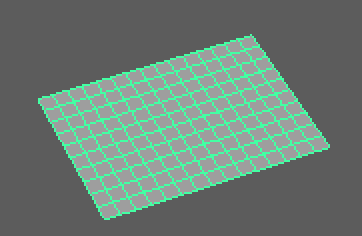

# 1. Modeling-Polygon Meshes

## 1. PolySphere


polySphere\(\[[axis](http://download.autodesk.com/us/maya/2011help/CommandsPython/polySphere.html#flagaxis)=\[linear, linear, linear\]\], \[[constructionHistory](http://download.autodesk.com/us/maya/2011help/CommandsPython/polySphere.html#flagconstructionHistory)=boolean\], \[[createUVs](http://download.autodesk.com/us/maya/2011help/CommandsPython/polySphere.html#flagcreateUVs)=int\], \[[name](http://download.autodesk.com/us/maya/2011help/CommandsPython/polySphere.html#flagname)=string\], \[[object](http://download.autodesk.com/us/maya/2011help/CommandsPython/polySphere.html#flagobject)=boolean\], \[[radius](http://download.autodesk.com/us/maya/2011help/CommandsPython/polySphere.html#flagradius)=linear\], \[[subdivisionsX](http://download.autodesk.com/us/maya/2011help/CommandsPython/polySphere.html#flagsubdivisionsX)=int\], \[[subdivisionsY](http://download.autodesk.com/us/maya/2011help/CommandsPython/polySphere.html#flagsubdivisionsY)=int\], \[[texture](http://download.autodesk.com/us/maya/2011help/CommandsPython/polySphere.html#flagtexture)=int\]\)

```python
import maya.cmds as cmds

# Create a sphere, with 10 subdivisions in the X direction,
# and 15 subdivisions in the Y direction,
# the radius of the sphere is 20.
cmds.polySphere(sx=10, sy=15, r=20)

# Create a sphere, called "mySphere", on each direction there are 5 subdivisions.
cmds.polySphere( n='mySphere', sx=5, sy=5)

# Query the radius of the new sphere
r = cmds.polySphere( 'mySphere', q=True, sx=True )
```

## 2. polyCube


polyCube\(\[[axis](http://download.autodesk.com/us/maya/2011help/CommandsPython/polyCube.html#flagaxis)=\[linear, linear, linear\]\], \[[constructionHistory](http://download.autodesk.com/us/maya/2011help/CommandsPython/polyCube.html#flagconstructionHistory)=boolean\], \[[createUVs](http://download.autodesk.com/us/maya/2011help/CommandsPython/polyCube.html#flagcreateUVs)=int\], \[[depth](http://download.autodesk.com/us/maya/2011help/CommandsPython/polyCube.html#flagdepth)=linear\], \[[height](http://download.autodesk.com/us/maya/2011help/CommandsPython/polyCube.html#flagheight)=linear\], \[[name](http://download.autodesk.com/us/maya/2011help/CommandsPython/polyCube.html#flagname)=string\], \[[object](http://download.autodesk.com/us/maya/2011help/CommandsPython/polyCube.html#flagobject)=boolean\], \[[subdivisionsX](http://download.autodesk.com/us/maya/2011help/CommandsPython/polyCube.html#flagsubdivisionsX)=int\], \[[subdivisionsY](http://download.autodesk.com/us/maya/2011help/CommandsPython/polyCube.html#flagsubdivisionsY)=int\], \[[subdivisionsZ](http://download.autodesk.com/us/maya/2011help/CommandsPython/polyCube.html#flagsubdivisionsZ)=int\], \[[texture](http://download.autodesk.com/us/maya/2011help/CommandsPython/polyCube.html#flagtexture)=int\], \[[width](http://download.autodesk.com/us/maya/2011help/CommandsPython/polyCube.html#flagwidth)=linear\]\)

```python
import maya.cmds as cmds

cmds.polyCube( sx=10, sy=15, sz=5, h=20 )
#result is a 20 units height rectangular box
#with 10 subdivisions along X, 15 along Y and 20 along Z.

cmds.polyCube( sx=5, sy=5, sz=5 )
#result has 5 subdivisions along all directions, default size

# query the width of a cube
w = cmds.polyCube( 'polyCube1', q=True, w=True )
```

## 3. polyCylinder


polyCylinder\(\[[axis](http://download.autodesk.com/us/maya/2011help/CommandsPython/polyCylinder.html#flagaxis)=\[linear, linear, linear\]\], \[[constructionHistory](http://download.autodesk.com/us/maya/2011help/CommandsPython/polyCylinder.html#flagconstructionHistory)=boolean\], \[[createUVs](http://download.autodesk.com/us/maya/2011help/CommandsPython/polyCylinder.html#flagcreateUVs)=int\], \[[height](http://download.autodesk.com/us/maya/2011help/CommandsPython/polyCylinder.html#flagheight)=linear\], \[[name](http://download.autodesk.com/us/maya/2011help/CommandsPython/polyCylinder.html#flagname)=string\], \[[object](http://download.autodesk.com/us/maya/2011help/CommandsPython/polyCylinder.html#flagobject)=boolean\], \[[radius](http://download.autodesk.com/us/maya/2011help/CommandsPython/polyCylinder.html#flagradius)=linear\], \[[subdivisionsX](http://download.autodesk.com/us/maya/2011help/CommandsPython/polyCylinder.html#flagsubdivisionsX)=int\], \[[subdivisionsY](http://download.autodesk.com/us/maya/2011help/CommandsPython/polyCylinder.html#flagsubdivisionsY)=int\], \[[subdivisionsZ](http://download.autodesk.com/us/maya/2011help/CommandsPython/polyCylinder.html#flagsubdivisionsZ)=int\], \[[texture](http://download.autodesk.com/us/maya/2011help/CommandsPython/polyCylinder.html#flagtexture)=int\]\)

```python
import maya.cmds as cmds

# Create a rectangle, with 10 subdivisions in the X direction,
# 15 subdivisions in the Y direction and 20 subdivisions in the Z direction,
# the height of the cylinder is 20.
cmds.polyCylinder( sx=10, sy=15, sz=5, h=20)

# Create a cylinder, called "myCylinder", on each direction there are 5 subdivisions.
cmds.polyCylinder(n='myCylinder', sx=5, sy=5, sz=5)

# Query the radius of "myCylinder"
r = cmds.polyCylinder( 'myCylinder', q=True, r=True )
```

## 4. polyCone


polyCone\(\[[axis](http://download.autodesk.com/us/maya/2011help/CommandsPython/polyCone.html#flagaxis)=\[linear, linear, linear\]\], \[[constructionHistory](http://download.autodesk.com/us/maya/2011help/CommandsPython/polyCone.html#flagconstructionHistory)=boolean\], \[[createUVs](http://download.autodesk.com/us/maya/2011help/CommandsPython/polyCone.html#flagcreateUVs)=int\], \[[height](http://download.autodesk.com/us/maya/2011help/CommandsPython/polyCone.html#flagheight)=linear\], \[[name](http://download.autodesk.com/us/maya/2011help/CommandsPython/polyCone.html#flagname)=string\], \[[object](http://download.autodesk.com/us/maya/2011help/CommandsPython/polyCone.html#flagobject)=boolean\], \[[radius](http://download.autodesk.com/us/maya/2011help/CommandsPython/polyCone.html#flagradius)=linear\], \[[subdivisionsX](http://download.autodesk.com/us/maya/2011help/CommandsPython/polyCone.html#flagsubdivisionsX)=int\], \[[subdivisionsY](http://download.autodesk.com/us/maya/2011help/CommandsPython/polyCone.html#flagsubdivisionsY)=int\], \[[subdivisionsZ](http://download.autodesk.com/us/maya/2011help/CommandsPython/polyCone.html#flagsubdivisionsZ)=int\], \[[texture](http://download.autodesk.com/us/maya/2011help/CommandsPython/polyCone.html#flagtexture)=boolean\]\)

```python
import maya.cmds as cmds

# Create a cone, with 10 subdivisions in the X direction,
# 15 subdivisions in the Y direction and 20 subdivisions in the Z direction,
# the radius of the cone is 20, the height of the cone is 10.
cmds.polyCone( sx=10, sy=15, sz=5, r=20, h=10)

# Create a cone, called "myCone", on each direction there are 5 subdivisions.
cmds.polyCone( n='myCone', sx=5, sy=5, sz=5)

# Query the radius of "myCone"
r = cmds.polyCone( 'myCone', q=True, r=True )
```

## 5. polyTorus


polyTorus\(\[[axis](http://download.autodesk.com/us/maya/2011help/CommandsPython/polyTorus.html#flagaxis)=\[linear, linear, linear\]\], \[[constructionHistory](http://download.autodesk.com/us/maya/2011help/CommandsPython/polyTorus.html#flagconstructionHistory)=boolean\], \[[createUVs](http://download.autodesk.com/us/maya/2011help/CommandsPython/polyTorus.html#flagcreateUVs)=boolean\], \[[name](http://download.autodesk.com/us/maya/2011help/CommandsPython/polyTorus.html#flagname)=string\], \[[object](http://download.autodesk.com/us/maya/2011help/CommandsPython/polyTorus.html#flagobject)=boolean\], \[[radius](http://download.autodesk.com/us/maya/2011help/CommandsPython/polyTorus.html#flagradius)=linear\], \[[sectionRadius](http://download.autodesk.com/us/maya/2011help/CommandsPython/polyTorus.html#flagsectionRadius)=linear\], \[[subdivisionsX](http://download.autodesk.com/us/maya/2011help/CommandsPython/polyTorus.html#flagsubdivisionsX)=int\], \[[subdivisionsY](http://download.autodesk.com/us/maya/2011help/CommandsPython/polyTorus.html#flagsubdivisionsY)=int\], \[[texture](http://download.autodesk.com/us/maya/2011help/CommandsPython/polyTorus.html#flagtexture)=boolean\], \[[twist](http://download.autodesk.com/us/maya/2011help/CommandsPython/polyTorus.html#flagtwist)=angle\]\)

```python
import maya.cmds as cmds

cmds.polyTorus( sx=8, sy=16, r=10, sr=1 )
#result has 8 sections of 16 segments,
#the main radius is 10, the section radius is 1.

cmds.polyTorus( sx=5, sy=4, tx=False )
cmds.move( -3, 0, 0 )
#result has 5 sections of 4 segments, default sizes.
#no texture offsets are generated.

cmds.polyTorus( sx=5, sy=4, tw=45 )
cmds.move( 3, 0, 0 )
#result has 5 sections of 4 segments, default sizes.
#The sections are rotated.

#Query the radius of the torus
r = cmds.polyTorus( 'polyTorus1' ,q=True, r=True )
```

## 6. polyPyramid


polyPyramid\(\[[axis](http://download.autodesk.com/us/maya/2011help/CommandsPython/polyPyramid.html#flagaxis)=\[linear, linear, linear\]\], \[[constructionHistory](http://download.autodesk.com/us/maya/2011help/CommandsPython/polyPyramid.html#flagconstructionHistory)=boolean\], \[[createUVs](http://download.autodesk.com/us/maya/2011help/CommandsPython/polyPyramid.html#flagcreateUVs)=int\], \[[name](http://download.autodesk.com/us/maya/2011help/CommandsPython/polyPyramid.html#flagname)=string\], \[[numberOfSides](http://download.autodesk.com/us/maya/2011help/CommandsPython/polyPyramid.html#flagnumberOfSides)=int\], \[[object](http://download.autodesk.com/us/maya/2011help/CommandsPython/polyPyramid.html#flagobject)=boolean\], \[[sideLength](http://download.autodesk.com/us/maya/2011help/CommandsPython/polyPyramid.html#flagsideLength)=linear\], \[[subdivisionsCaps](http://download.autodesk.com/us/maya/2011help/CommandsPython/polyPyramid.html#flagsubdivisionsCaps)=int\], \[[subdivisionsHeight](http://download.autodesk.com/us/maya/2011help/CommandsPython/polyPyramid.html#flagsubdivisionsHeight)=int\], \[[texture](http://download.autodesk.com/us/maya/2011help/CommandsPython/polyPyramid.html#flagtexture)=boolean\]\)

```python
import maya.cmds as cmds

# Create a pyramid, with 10 subdivisions on the caps,
# 15 subdivisions along the height and num ber of sides 5,
# the side length of the pyramid is 20, the height of the pyramid is 10.
cmds.polyPyramid( sc=10, sh=15, ns=5, w=20)

# Create a pyramid, called "mypyramid", olong height there are 5 subdivisions
# and with 5 sides.
cmds.polyPyramid( n='mypyramid', sh=5, ns=5, sc=5)

# Query the side length of "mypyramid"
w = cmds.polyPyramid( 'mypyramid', q=True, w=True )
```

## 7. polyPipe


polyPipe\(\[[axis](http://download.autodesk.com/us/maya/2011help/CommandsPython/polyPipe.html#flagaxis)=\[linear, linear, linear\]\], \[[constructionHistory](http://download.autodesk.com/us/maya/2011help/CommandsPython/polyPipe.html#flagconstructionHistory)=boolean\], \[[createUVs](http://download.autodesk.com/us/maya/2011help/CommandsPython/polyPipe.html#flagcreateUVs)=boolean\], \[[height](http://download.autodesk.com/us/maya/2011help/CommandsPython/polyPipe.html#flagheight)=linear\], \[[name](http://download.autodesk.com/us/maya/2011help/CommandsPython/polyPipe.html#flagname)=string\], \[[object](http://download.autodesk.com/us/maya/2011help/CommandsPython/polyPipe.html#flagobject)=boolean\], \[[radius](http://download.autodesk.com/us/maya/2011help/CommandsPython/polyPipe.html#flagradius)=linear\], \[[subdivisionsCaps](http://download.autodesk.com/us/maya/2011help/CommandsPython/polyPipe.html#flagsubdivisionsCaps)=int\], \[[subdivisionsHeight](http://download.autodesk.com/us/maya/2011help/CommandsPython/polyPipe.html#flagsubdivisionsHeight)=int\], \[[texture](http://download.autodesk.com/us/maya/2011help/CommandsPython/polyPipe.html#flagtexture)=boolean\], \[[thickness](http://download.autodesk.com/us/maya/2011help/CommandsPython/polyPipe.html#flagthickness)=linear\]\)

```python
import maya.cmds as cmds

# Create a pipe with height 20 radius 1.0 thickness 0.5 with
# 10 subdivisions along height
cmds.polyPipe( sh=10, h=20 )

# Create a pipe, called "myPipe", on thickness cap there are 5
# subdivisions.
cmds.polyPipe( n='myPipe', sc=5);
```

## 8. polyPlane



polyPlane\(\[[axis](http://download.autodesk.com/us/maya/2011help/CommandsPython/polyPlane.html#flagaxis)=\[linear, linear, linear\]\], \[[constructionHistory](http://download.autodesk.com/us/maya/2011help/CommandsPython/polyPlane.html#flagconstructionHistory)=boolean\], \[[createUVs](http://download.autodesk.com/us/maya/2011help/CommandsPython/polyPlane.html#flagcreateUVs)=int\], \[[height](http://download.autodesk.com/us/maya/2011help/CommandsPython/polyPlane.html#flagheight)=linear\], \[[name](http://download.autodesk.com/us/maya/2011help/CommandsPython/polyPlane.html#flagname)=string\], \[[object](http://download.autodesk.com/us/maya/2011help/CommandsPython/polyPlane.html#flagobject)=boolean\], \[[subdivisionsX](http://download.autodesk.com/us/maya/2011help/CommandsPython/polyPlane.html#flagsubdivisionsX)=int\], \[[subdivisionsY](http://download.autodesk.com/us/maya/2011help/CommandsPython/polyPlane.html#flagsubdivisionsY)=int\], \[[texture](http://download.autodesk.com/us/maya/2011help/CommandsPython/polyPlane.html#flagtexture)=int\], \[[width](http://download.autodesk.com/us/maya/2011help/CommandsPython/polyPlane.html#flagwidth)=linear\]\)

```python
import maya.cmds as cmds

# Create a mesh (plane), with 10 subdivisions in the X direction,
# 15 subdivisions in the Y direction,
# the width of the mesh is 15, the height of the mesh is 20.
cmds.polyPlane( sx=10, sy=15, w=15, h=20)

# Create a mesh, called "myPlane", on each direction there are 5 subdivisions.
cmds.polyPlane(n='myPlane', sx=5, sy=5)
```

## 9. polyCreateFacet

Create a new polygonal object with the specified face, which will be closed. List of arguments must have at least 3 points.


polyCreateFacet\(\[[constructionHistory](http://download.autodesk.com/us/maya/2011help/CommandsPython/polyCreateFacet.html#flagconstructionHistory)=boolean\], \[[hole](http://download.autodesk.com/us/maya/2011help/CommandsPython/polyCreateFacet.html#flaghole)=boolean\], \[[name](http://download.autodesk.com/us/maya/2011help/CommandsPython/polyCreateFacet.html#flagname)=string\], \[[point](http://download.autodesk.com/us/maya/2011help/CommandsPython/polyCreateFacet.html#flagpoint)=\[\[, float, float, float, \]\]\], \[[subdivision](http://download.autodesk.com/us/maya/2011help/CommandsPython/polyCreateFacet.html#flagsubdivision)=int\], \[[texture](http://download.autodesk.com/us/maya/2011help/CommandsPython/polyCreateFacet.html#flagtexture)=int\]\)

```python
import maya.cmds as cmds

# Create a triangular facet
cmds.polyCreateFacet( p=[(0.0, 0.0, 0.0), (10.0, 0.0, 0.0), (10.0, 10.0, 0.0)] )
```

## 10. polyAppend

Appends a new face to the selected polygonal object. The first argument must be a border edge. The new face will be automatically closed. Only works with one object selected.

polyAppend\(\[[append](http://download.autodesk.com/us/maya/2011help/CommandsPython/polyAppend.html#flagappend)=\[\[, float, float, float, \]\]\], \[[constructionHistory](http://download.autodesk.com/us/maya/2011help/CommandsPython/polyAppend.html#flagconstructionHistory)=boolean\], \[[edge](http://download.autodesk.com/us/maya/2011help/CommandsPython/polyAppend.html#flagedge)=int\], \[[hole](http://download.autodesk.com/us/maya/2011help/CommandsPython/polyAppend.html#flaghole)=boolean\], \[[name](http://download.autodesk.com/us/maya/2011help/CommandsPython/polyAppend.html#flagname)=string\], \[[point](http://download.autodesk.com/us/maya/2011help/CommandsPython/polyAppend.html#flagpoint)=\[float, float, float\]\], \[[subdivision](http://download.autodesk.com/us/maya/2011help/CommandsPython/polyAppend.html#flagsubdivision)=int\], \[[texture](http://download.autodesk.com/us/maya/2011help/CommandsPython/polyAppend.html#flagtexture)=int\]\)

```python
import maya.cmds as cmds

cmds.polyCreateFacet( p=[(0, 0, 0), (10, 0, 0), (10, 10, 0), (0, 10, 0)] )

#add a new triangular facet described by the edge #0, and a free point
cmds.polyAppend( a=[0, (5, -5, 0)] )

#add a new quadrangular facet with 2 triangular holes.
cmds.polyAppend( a=[1, (20, 0, 0), (20, 10, 0), (), (12, 6, 0), (14, 5, 0), (12, 4, 0), (), (16, 5, 0), (18, 6, 0), (18, 4, 0)] )
```

## 11. polyExtrudeFacet

Extrude faces. Faces can be extruded separately or together, and manipulations can be performed either in world or object space.

polyExtrudeFacet\(\[[attraction](http://download.autodesk.com/us/maya/2011help/CommandsPython/polyExtrudeFacet.html#flagattraction)=float\], \[[caching](http://download.autodesk.com/us/maya/2011help/CommandsPython/polyExtrudeFacet.html#flagcaching)=boolean\], \[[constructionHistory](http://download.autodesk.com/us/maya/2011help/CommandsPython/polyExtrudeFacet.html#flagconstructionHistory)=boolean\], \[[divisions](http://download.autodesk.com/us/maya/2011help/CommandsPython/polyExtrudeFacet.html#flagdivisions)=int\], \[[gravity](http://download.autodesk.com/us/maya/2011help/CommandsPython/polyExtrudeFacet.html#flaggravity)=\[linear, linear, linear\]\], \[[gravityX](http://download.autodesk.com/us/maya/2011help/CommandsPython/polyExtrudeFacet.html#flaggravityX)=linear\], \[[gravityY](http://download.autodesk.com/us/maya/2011help/CommandsPython/polyExtrudeFacet.html#flaggravityY)=linear\], \[[gravityZ](http://download.autodesk.com/us/maya/2011help/CommandsPython/polyExtrudeFacet.html#flaggravityZ)=linear\], \[[inputCurve](http://download.autodesk.com/us/maya/2011help/CommandsPython/polyExtrudeFacet.html#flaginputCurve)=name\], \[[keepFacesTogether](http://download.autodesk.com/us/maya/2011help/CommandsPython/polyExtrudeFacet.html#flagkeepFacesTogether)=boolean\], \[[localDirection](http://download.autodesk.com/us/maya/2011help/CommandsPython/polyExtrudeFacet.html#flaglocalDirection)=\[linear, linear, linear\]\], \[[localDirectionX](http://download.autodesk.com/us/maya/2011help/CommandsPython/polyExtrudeFacet.html#flaglocalDirectionX)=linear\], \[[localDirectionY](http://download.autodesk.com/us/maya/2011help/CommandsPython/polyExtrudeFacet.html#flaglocalDirectionY)=linear\], \[[localDirectionZ](http://download.autodesk.com/us/maya/2011help/CommandsPython/polyExtrudeFacet.html#flaglocalDirectionZ)=linear\], \[[localRotate](http://download.autodesk.com/us/maya/2011help/CommandsPython/polyExtrudeFacet.html#flaglocalRotate)=\[angle, angle, angle\]\], \[[localRotateX](http://download.autodesk.com/us/maya/2011help/CommandsPython/polyExtrudeFacet.html#flaglocalRotateX)=angle\], \[[localRotateY](http://download.autodesk.com/us/maya/2011help/CommandsPython/polyExtrudeFacet.html#flaglocalRotateY)=angle\], \[[localRotateZ](http://download.autodesk.com/us/maya/2011help/CommandsPython/polyExtrudeFacet.html#flaglocalRotateZ)=angle\], \[[localScale](http://download.autodesk.com/us/maya/2011help/CommandsPython/polyExtrudeFacet.html#flaglocalScale)=\[float, float, float\]\], \[[localScaleX](http://download.autodesk.com/us/maya/2011help/CommandsPython/polyExtrudeFacet.html#flaglocalScaleX)=float\], \[[localScaleY](http://download.autodesk.com/us/maya/2011help/CommandsPython/polyExtrudeFacet.html#flaglocalScaleY)=float\], \[[localScaleZ](http://download.autodesk.com/us/maya/2011help/CommandsPython/polyExtrudeFacet.html#flaglocalScaleZ)=float\], \[[localTranslate](http://download.autodesk.com/us/maya/2011help/CommandsPython/polyExtrudeFacet.html#flaglocalTranslate)=\[linear, linear, linear\]\], \[[localTranslateX](http://download.autodesk.com/us/maya/2011help/CommandsPython/polyExtrudeFacet.html#flaglocalTranslateX)=linear\], \[[localTranslateY](http://download.autodesk.com/us/maya/2011help/CommandsPython/polyExtrudeFacet.html#flaglocalTranslateY)=linear\], \[[localTranslateZ](http://download.autodesk.com/us/maya/2011help/CommandsPython/polyExtrudeFacet.html#flaglocalTranslateZ)=linear\], \[[magnX](http://download.autodesk.com/us/maya/2011help/CommandsPython/polyExtrudeFacet.html#flagmagnX)=linear\], \[[magnY](http://download.autodesk.com/us/maya/2011help/CommandsPython/polyExtrudeFacet.html#flagmagnY)=linear\], \[[magnet](http://download.autodesk.com/us/maya/2011help/CommandsPython/polyExtrudeFacet.html#flagmagnet)=\[linear, linear, linear\]\], \[[name](http://download.autodesk.com/us/maya/2011help/CommandsPython/polyExtrudeFacet.html#flagname)=string\], \[[nodeState](http://download.autodesk.com/us/maya/2011help/CommandsPython/polyExtrudeFacet.html#flagnodeState)=int\], \[[offset](http://download.autodesk.com/us/maya/2011help/CommandsPython/polyExtrudeFacet.html#flagoffset)=float\], \[[pivot](http://download.autodesk.com/us/maya/2011help/CommandsPython/polyExtrudeFacet.html#flagpivot)=\[linear, linear, linear\]\], \[[pivotX](http://download.autodesk.com/us/maya/2011help/CommandsPython/polyExtrudeFacet.html#flagpivotX)=linear\], \[[pivotY](http://download.autodesk.com/us/maya/2011help/CommandsPython/polyExtrudeFacet.html#flagpivotY)=linear\], \[[pivotZ](http://download.autodesk.com/us/maya/2011help/CommandsPython/polyExtrudeFacet.html#flagpivotZ)=linear\], \[[random](http://download.autodesk.com/us/maya/2011help/CommandsPython/polyExtrudeFacet.html#flagrandom)=float\], \[[rotate](http://download.autodesk.com/us/maya/2011help/CommandsPython/polyExtrudeFacet.html#flagrotate)=\[angle, angle, angle\]\], \[[rotateX](http://download.autodesk.com/us/maya/2011help/CommandsPython/polyExtrudeFacet.html#flagrotateX)=angle\], \[[rotateY](http://download.autodesk.com/us/maya/2011help/CommandsPython/polyExtrudeFacet.html#flagrotateY)=angle\], \[[rotateZ](http://download.autodesk.com/us/maya/2011help/CommandsPython/polyExtrudeFacet.html#flagrotateZ)=angle\], \[[scale](http://download.autodesk.com/us/maya/2011help/CommandsPython/polyExtrudeFacet.html#flagscale)=\[float, float, float\]\], \[[scaleX](http://download.autodesk.com/us/maya/2011help/CommandsPython/polyExtrudeFacet.html#flagscaleX)=float\], \[[scaleY](http://download.autodesk.com/us/maya/2011help/CommandsPython/polyExtrudeFacet.html#flagscaleY)=float\], \[[scaleZ](http://download.autodesk.com/us/maya/2011help/CommandsPython/polyExtrudeFacet.html#flagscaleZ)=float\], \[[smoothingAngle](http://download.autodesk.com/us/maya/2011help/CommandsPython/polyExtrudeFacet.html#flagsmoothingAngle)=angle\], \[[translate](http://download.autodesk.com/us/maya/2011help/CommandsPython/polyExtrudeFacet.html#flagtranslate)=\[linear, linear, linear\]\], \[[translateX](http://download.autodesk.com/us/maya/2011help/CommandsPython/polyExtrudeFacet.html#flagtranslateX)=linear\], \[[translateY](http://download.autodesk.com/us/maya/2011help/CommandsPython/polyExtrudeFacet.html#flagtranslateY)=linear\], \[[translateZ](http://download.autodesk.com/us/maya/2011help/CommandsPython/polyExtrudeFacet.html#flagtranslateZ)=linear\], \[[weight](http://download.autodesk.com/us/maya/2011help/CommandsPython/polyExtrudeFacet.html#flagweight)=float\], \[[worldSpace](http://download.autodesk.com/us/maya/2011help/CommandsPython/polyExtrudeFacet.html#flagworldSpace)=boolean\]\)

```python
import maya.cmds as cmds

# Separate
cmds.polyPlane( n='plg', w=10, h=10 )
cmds.polyExtrudeFacet( 'plg.f[71:72]', 'plg.f[81:82]', kft=False, ltz=2, ls=(.5, .5, 0) )
# Facets are extruded then scaled separately

# Together
cmds.polyExtrudeFacet( 'plg.f[17:18]', 'plg.f[27:28]', kft=True, ltz=2, ls=(.5, .5, 0) )
# Facets are extruded then scaled together
```

## 12. polyExtrudeEdge

Extrude edges separately or together.

polyExtrudeEdge\(\[[caching](http://download.autodesk.com/us/maya/2011help/CommandsPython/polyExtrudeEdge.html#flagcaching)=boolean\], \[[constructionHistory](http://download.autodesk.com/us/maya/2011help/CommandsPython/polyExtrudeEdge.html#flagconstructionHistory)=boolean\], \[[divisions](http://download.autodesk.com/us/maya/2011help/CommandsPython/polyExtrudeEdge.html#flagdivisions)=int\], \[[inputCurve](http://download.autodesk.com/us/maya/2011help/CommandsPython/polyExtrudeEdge.html#flaginputCurve)=name\], \[[keepFacesTogether](http://download.autodesk.com/us/maya/2011help/CommandsPython/polyExtrudeEdge.html#flagkeepFacesTogether)=boolean\], \[[localDirection](http://download.autodesk.com/us/maya/2011help/CommandsPython/polyExtrudeEdge.html#flaglocalDirection)=\[linear, linear, linear\]\], \[[localDirectionX](http://download.autodesk.com/us/maya/2011help/CommandsPython/polyExtrudeEdge.html#flaglocalDirectionX)=linear\], \[[localDirectionY](http://download.autodesk.com/us/maya/2011help/CommandsPython/polyExtrudeEdge.html#flaglocalDirectionY)=linear\], \[[localDirectionZ](http://download.autodesk.com/us/maya/2011help/CommandsPython/polyExtrudeEdge.html#flaglocalDirectionZ)=linear\], \[[localRotate](http://download.autodesk.com/us/maya/2011help/CommandsPython/polyExtrudeEdge.html#flaglocalRotate)=\[angle, angle, angle\]\], \[[localRotateX](http://download.autodesk.com/us/maya/2011help/CommandsPython/polyExtrudeEdge.html#flaglocalRotateX)=angle\], \[[localRotateY](http://download.autodesk.com/us/maya/2011help/CommandsPython/polyExtrudeEdge.html#flaglocalRotateY)=angle\], \[[localRotateZ](http://download.autodesk.com/us/maya/2011help/CommandsPython/polyExtrudeEdge.html#flaglocalRotateZ)=angle\], \[[localScale](http://download.autodesk.com/us/maya/2011help/CommandsPython/polyExtrudeEdge.html#flaglocalScale)=\[float, float, float\]\], \[[localScaleX](http://download.autodesk.com/us/maya/2011help/CommandsPython/polyExtrudeEdge.html#flaglocalScaleX)=float\], \[[localScaleY](http://download.autodesk.com/us/maya/2011help/CommandsPython/polyExtrudeEdge.html#flaglocalScaleY)=float\], \[[localScaleZ](http://download.autodesk.com/us/maya/2011help/CommandsPython/polyExtrudeEdge.html#flaglocalScaleZ)=float\], \[[localTranslate](http://download.autodesk.com/us/maya/2011help/CommandsPython/polyExtrudeEdge.html#flaglocalTranslate)=\[linear, linear, linear\]\], \[[localTranslateX](http://download.autodesk.com/us/maya/2011help/CommandsPython/polyExtrudeEdge.html#flaglocalTranslateX)=linear\], \[[localTranslateY](http://download.autodesk.com/us/maya/2011help/CommandsPython/polyExtrudeEdge.html#flaglocalTranslateY)=linear\], \[[localTranslateZ](http://download.autodesk.com/us/maya/2011help/CommandsPython/polyExtrudeEdge.html#flaglocalTranslateZ)=linear\], \[[name](http://download.autodesk.com/us/maya/2011help/CommandsPython/polyExtrudeEdge.html#flagname)=string\], \[[nodeState](http://download.autodesk.com/us/maya/2011help/CommandsPython/polyExtrudeEdge.html#flagnodeState)=int\], \[[pivot](http://download.autodesk.com/us/maya/2011help/CommandsPython/polyExtrudeEdge.html#flagpivot)=\[linear, linear, linear\]\], \[[pivotX](http://download.autodesk.com/us/maya/2011help/CommandsPython/polyExtrudeEdge.html#flagpivotX)=linear\], \[[pivotY](http://download.autodesk.com/us/maya/2011help/CommandsPython/polyExtrudeEdge.html#flagpivotY)=linear\], \[[pivotZ](http://download.autodesk.com/us/maya/2011help/CommandsPython/polyExtrudeEdge.html#flagpivotZ)=linear\], \[[random](http://download.autodesk.com/us/maya/2011help/CommandsPython/polyExtrudeEdge.html#flagrandom)=float\], \[[rotate](http://download.autodesk.com/us/maya/2011help/CommandsPython/polyExtrudeEdge.html#flagrotate)=\[angle, angle, angle\]\], \[[rotateX](http://download.autodesk.com/us/maya/2011help/CommandsPython/polyExtrudeEdge.html#flagrotateX)=angle\], \[[rotateY](http://download.autodesk.com/us/maya/2011help/CommandsPython/polyExtrudeEdge.html#flagrotateY)=angle\], \[[rotateZ](http://download.autodesk.com/us/maya/2011help/CommandsPython/polyExtrudeEdge.html#flagrotateZ)=angle\], \[[scale](http://download.autodesk.com/us/maya/2011help/CommandsPython/polyExtrudeEdge.html#flagscale)=\[float, float, float\]\], \[[scaleX](http://download.autodesk.com/us/maya/2011help/CommandsPython/polyExtrudeEdge.html#flagscaleX)=float\], \[[scaleY](http://download.autodesk.com/us/maya/2011help/CommandsPython/polyExtrudeEdge.html#flagscaleY)=float\], \[[scaleZ](http://download.autodesk.com/us/maya/2011help/CommandsPython/polyExtrudeEdge.html#flagscaleZ)=float\], \[[smoothingAngle](http://download.autodesk.com/us/maya/2011help/CommandsPython/polyExtrudeEdge.html#flagsmoothingAngle)=angle\], \[[translate](http://download.autodesk.com/us/maya/2011help/CommandsPython/polyExtrudeEdge.html#flagtranslate)=\[linear, linear, linear\]\], \[[translateX](http://download.autodesk.com/us/maya/2011help/CommandsPython/polyExtrudeEdge.html#flagtranslateX)=linear\], \[[translateY](http://download.autodesk.com/us/maya/2011help/CommandsPython/polyExtrudeEdge.html#flagtranslateY)=linear\], \[[translateZ](http://download.autodesk.com/us/maya/2011help/CommandsPython/polyExtrudeEdge.html#flagtranslateZ)=linear\], \[[worldSpace](http://download.autodesk.com/us/maya/2011help/CommandsPython/polyExtrudeEdge.html#flagworldSpace)=boolean\]\)

```python
import maya.cmds as cmds

# Separate
cmds.polyPlane( n='plg', w=10, h=10 )
cmds.polyExtrudeEdge( 'plg.e[71:72]', 'plg.e[81:82]', kft=False,, ltz=2, ls=(.5, .5, 0) )
# Edges are extruded then scaled separately
cmds.delete( 'plg' )


# Together
cmds.polyPlane( n='plg', w=10, h=10 )
cmds.polyExtrudeEdge( 'plg.e[71:72]', 'plg.e[81:82]', kft=True, ltz=2, ls=(.5, .5, 0) )
# Edges are extruded then scaled together
cmds.delete( 'plg' )
```

## 13. polyMergeVertex

Merge vertices within a given threshold.  
Since this allows merging any vertices that lie on the same object it is possible for the resulting geometry to be non-manifold.  
First, perform comparison of pairs of selected vertices. Pairs that lie within given distance of one another are merged, along with the edge between them.  
Second, any selected vertices which share an edge are merged if the distance between them is within the specified distance.  
Unlike Merge Edges, Merge Vertices will perform the merge even if the edges adjoining the vertices do not have matching orientation \(i.e. normals of adjacent faces do not point in the same direction\). As this restriction is not enforced while merging vertices, resulting geometry can be non-manifold.  
If alwaysMergeTwoVertices is set and there are only two vertices, tolerance is ignored and the vertices will be merged.  
Resulting mesh may have extra vertices or edges to ensure geometry is valid.

polyMergeVertex\(\[[alwaysMergeTwoVertices](http://download.autodesk.com/us/maya/2011help/CommandsPython/polyMergeVertex.html#flagalwaysMergeTwoVertices)=boolean\], \[[caching](http://download.autodesk.com/us/maya/2011help/CommandsPython/polyMergeVertex.html#flagcaching)=boolean\], \[[constructionHistory](http://download.autodesk.com/us/maya/2011help/CommandsPython/polyMergeVertex.html#flagconstructionHistory)=boolean\], \[[distance](http://download.autodesk.com/us/maya/2011help/CommandsPython/polyMergeVertex.html#flagdistance)=linear\], \[[mergeToComponents](http://download.autodesk.com/us/maya/2011help/CommandsPython/polyMergeVertex.html#flagmergeToComponents)=string\], \[[name](http://download.autodesk.com/us/maya/2011help/CommandsPython/polyMergeVertex.html#flagname)=string\], \[[nodeState](http://download.autodesk.com/us/maya/2011help/CommandsPython/polyMergeVertex.html#flagnodeState)=int\], \[[texture](http://download.autodesk.com/us/maya/2011help/CommandsPython/polyMergeVertex.html#flagtexture)=boolean\]\)

```python
import maya.cmds as cmds

cmds.polyPlane( sx=5, sy=5, n='plg1' )
cmds.polyPlane( sx=5, sy=5, n='plg2' )
cmds.move( 0.55, 0, -1.25, 'plg1', ws=True )
cmds.move( -0.55, 0, -1.25, 'plg2', ws=True )
cmds.polyPlane( sx=5, sy=5, n='plg3' )
cmds.polyPlane( sx=5, sy=5, n='plg4' )
cmds.polyPlane( sx=5, sy=5, n='plg5' )
cmds.move( 0.55, 0, 1.25, 'plg4', ws=True )
cmds.move( -0.55, 0, 1.25, 'plg5', ws=True )

# First method:
cmds.polyUnite( 'plg1Shape', 'plg2Shape' )
cmds.select( 'polySurface1.vtx[6]', 'polySurface1.vtx[12]', 'polySurface1.vtx[18]', 'polySurface1.vtx[24]', 'polySurface1.vtx[47]', 'polySurface1.vtx[53]', 'polySurface1.vtx[59]', 'polySurface1.vtx[65]', r=True )
cmds.polyMergeVertex( d=0.15 )

# Second method:
cmds.polyMergeVertex( 'plg3.vtx[24]', 'plg3.vtx[30:31]', 'plg3.vtx[8:10]', 'plg3.vtx[14:16]', 'plg3.vtx[20:22]', d=0.25 )

# To create non-manifold geometry:
cmds.polyUnite( 'plg4Shape', 'plg5Shape' )
cmds.select( 'polySurface2.vtx[0]', 'polySurface2.vtx[6]', 'polySurface2.vtx[12]', 'polySurface2.vtx[18]', 'polySurface2.vtx[24]', 'polySurface2.vtx[30]', 'polySurface2.vtx[41]', 'polySurface2.vtx[47]', 'polySurface2.vtx[53]', 'polySurface2.vtx[59]', 'polySurface2.vtx[65]', 'polySurface2.vtx[71]', r=True )
cmds.polyMergeVertex( d=0.25 )
# Note that there is only one vertex at this merged point and the
# resulting polygonal object is non-manifold;()
```

